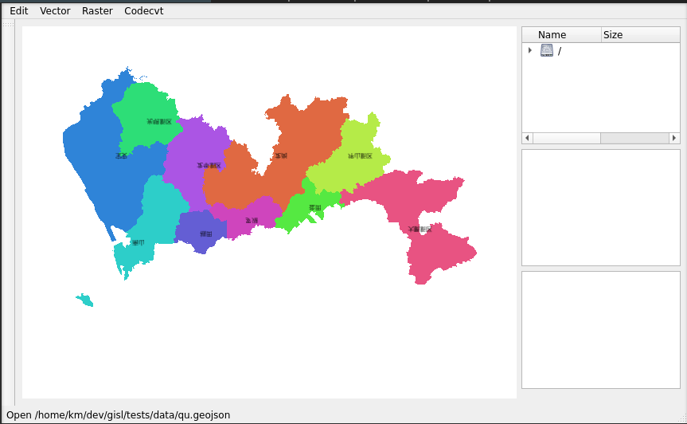
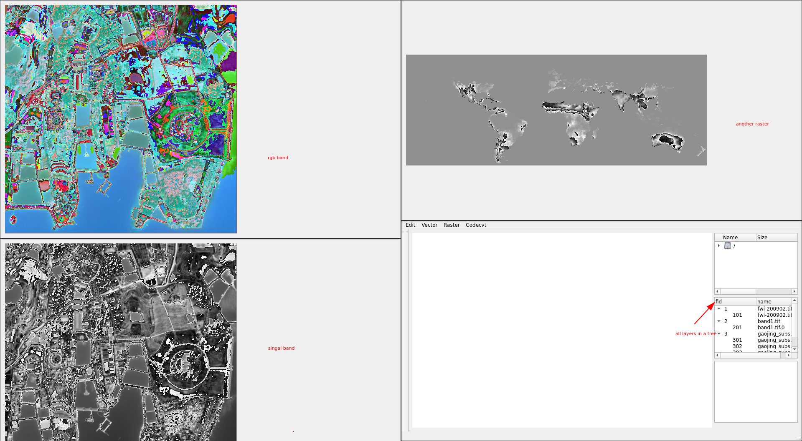

# GisL

[](https://github.com/zy6p/GisL/actions/workflows/build.yml)
[](https://github.com/zy6p/GisL/actions/workflows/doc.yml)

This program is a gis software -- practice for 3d Visualization lecture.

Official website is [GisL](https://zy6p.github.io/GisL/). It can encode and decode text. It can open and write .shp, .dbf, and .geojson. It also can use .sld to render layer style. And it can convert dem to mesh/tin and read tin/mesh data. In a word, it is an easy-to-use software.

## Gallery

 

## Feature

1. Easy to use and similar to qgis operations
2. Cross Platform
3. Support Vector formats include:
   - ESRI Shapefiles
   - GeoJson
   - All OGR support formats
4. Support style formats include:
   - sld
5. Support Mesh/Tin data.
6. Support raster formats include:
   - GeoTiff
   - All GDAL support formats
7. Support some geospatial analyse algorithms include:
   - Resize
   - convert raster to tin

## Build

1. git clone

```shell
git clone https://github.com/zy6p/GisL.git
cd GisL
git submodule update --init --recursive
```

2. install depth(ubuntu 20.04)

```shell
sudo su
./scripts/ubuntuGiser.sh
```

3. build

```shell
cmake -B build -S . -DWITH_ANALYSIS=1
cmake --build build --target gisl
```
