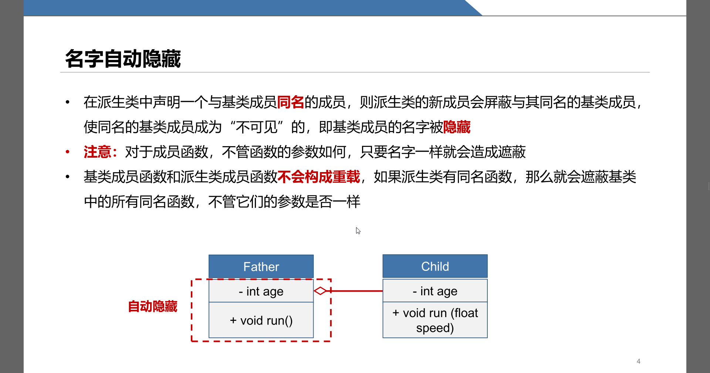
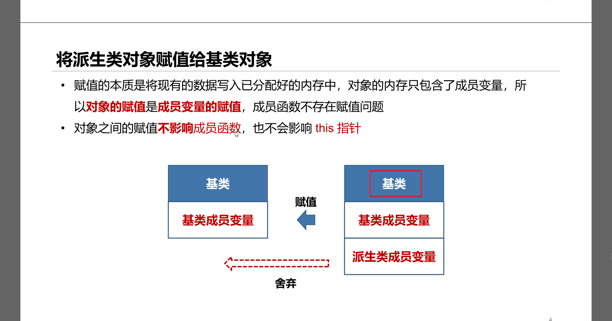

# bugs

1. src/codecvt/ solved
   
2. src/gui/symbolizer：重载、覆盖和遮蔽 基类symbolizer，派生类PolygonSymbollizer和TextSymbolizer，都有函数void rand(),void init()，父类函数是虚函数 solved

```    
class Symbolizer {
    public:
        virtual void init( QXmlStreamReader &sldStream ) = 0;

        virtual void rand( ) = 0;
    }
    
class PolygonSymbolizer : public Symbolizer {
    public:
        void rand( ) override;
        void init( QXmlStreamReader &sldStream ) override;
    }
    
class TextSymbolizer : public Symbolizer {
    public:
        void rand( ) final;
        void init( QXmlStreamReader &sldStream ) final;
    }
```

这些关键词如 override final有什么区别，都可以编译通过？ solved



3. src/gui/symbolizer：向上类型转换 在调用symbolizer时会经常需要写switch语句，因为需要调用其成员变量，所以我定义基类指针作用太小？need to refract

同样的问题出现在geometry，geometry是基类，派生类有点、线、面，但每次都要写switch，如src/core/vectorfeature.cpp

此处基类应为派生类



4. src/utils/ptroperate 用泛型来delete指针是否可行 yes solved

5. src/codecvt/dadecoder.cpp sortUnits 使用指针作为迭代器 no, std::sort() params are stl container not ptr. solved

6. map在gis里面有具体含义，用gis作为名字是否更合适？yes
